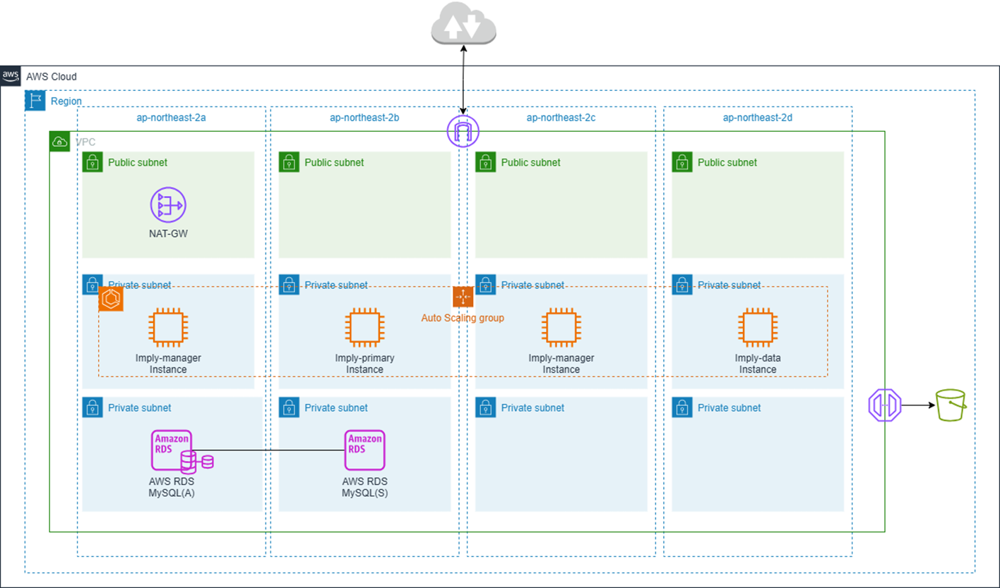

## imply-eks-vpc
<h5>
<pre>

</pre>
</h5>
<h3> # Architecture(with NAT) </h3>
<pre>

</pre>
<h3> # Architecture(with endpoint) </h3>
<pre>
- 차후 정의 예정입니다
</pre>

<h3> # Project Info </h3>
<h5>
<pre>

</pre>
</h5>